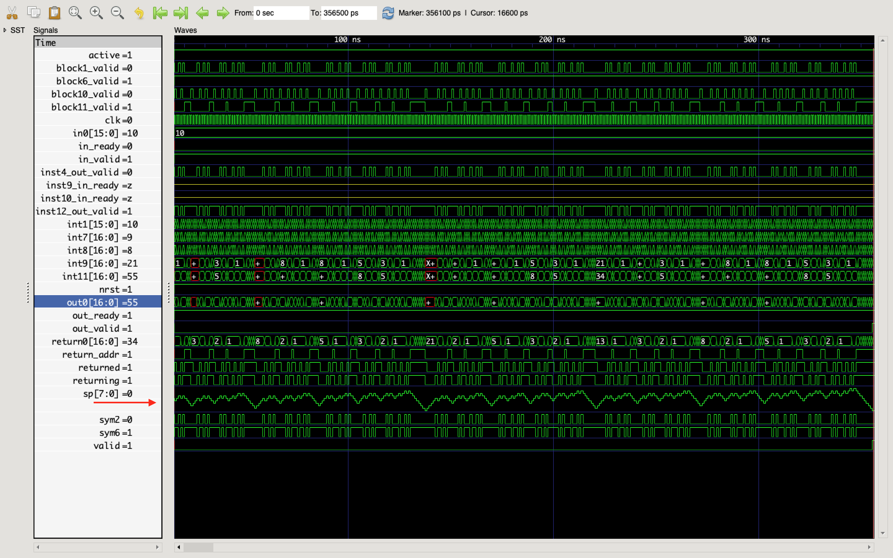

Popr Compiler 
============

This project implements a compiler for the Popr language.

Please see [this presentation](http://hackerfoo.com/presentations/ttpl_slides.html) for more information, and the [tutorial](http://www.hackerfoo.com/posts/popr-tutorial-0-dot-machines.html) to understand the language semantics.

More examples can be found in [lib.ppr](https://github.com/HackerFoo/poprc/blob/master/lib.ppr) and [tests.ppr](https://github.com/HackerFoo/poprc/blob/master/tests.ppr).

You can try the compiler online using the [PoprC web version](http://hackerfoo.com/eval.html).

PoprC targets both C and Verilog. For example, the familiar Fibonacci function:

    fib: [dup 1 <= !] [dup 1- dup 1- fib swap fib + swap 1 > !] | pushl head

can be compiled to Verilog and synthesized or simulated:

Note the stack pointer (sp). Recursion is fully supported, but must be bounded.

Here's a working AXI4-Lite slave:

    stream_read_array: swap [swap read_array swap] map_with
    
    stream_write_array: swap2 [-swap2 swap write_array dup True swap seq swap] zip_with
    
    stream_read_write_array:
      swap3 dup_array [-swap2 swap stream_write_array] dip31 swap
        [swap stream_read_array] dip21

when wrapped with a [bit of Verilog](https://github.com/HackerFoo/poprc/blob/master/testbenches/tests_axi_lite_slave_top.v) to map the signals properly.

License
=======

The license for the Popr Compiler is GPL3.  See LICENSE for more information.
